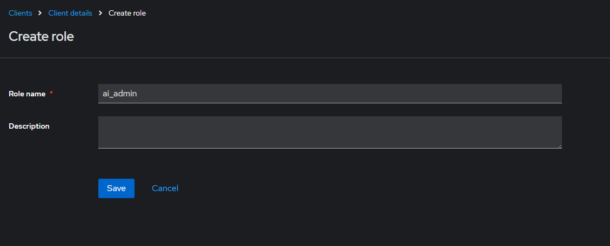

# IDEA4RC AI Platform deployment guide
This guide shows how to install the IDEA4RC AI Platform

1. Files retrieval procedure
2. Standalone Keycloak server installation
3. Keycloak server first configuration
4. Docker compose file configuration
5. Temporary services
6. Execution of the docker compose file

## 1. Files retrieval procedure
Go to the [Docker files GitHub repo](https://github.com/IDEA4RC/idea4rc-ai.git) and clone the project.

This project contains only docker files and, eventually, configuration files necessary to correctly execute the provided docker containers.

## 2. Standalone Keycloak server installation
Go into the security folder and look into the docker-compose.yml file. Here you can use the `environment` sections, in fact within these sections you can customize the keycloak's database properties and the properties related to the keycloak server. In any case, all the properties are already set for a correct execution.

After the customization you have to execute the following command

`docker-compose up -d`

Waiting for the server to start the process, after that (using the default environment values) you can direct your browser to the following URL and reach the keycloak server:

`http://keycloak:8080`

Use the `eng_admin` string for user and password input boxes. If you have changed the `KEYCLOAK_ADMIN` and the `KEYCLOAK_ADMIN_PASSWORD` environment properties, you have to use the new values set.

## 3. Keycloak server first configuration
Once you have entered into the keycloak's administration portal, you have to configure the following objects:

1. one keycloak client named as `idea4rc-ai-gui`
2. an application client role named as `ai_admin` related to the client created at the point 1
3. an application client role named as `ai_researcher` related to the client created at the point 1
4. make the `ai_admin` role as composite adding the `ai_researcher` role

### 1. Keycloak client

Using the `Clients` section, click on `Create client`

Use the string `idea4rc-ai-gui` as `Client ID` and click on `Next`

Set the client authentication properties as shown in the above figure, then click on `Next`

Set the `Root URL`, `Valid redirect URIs` and `Web origins` values as shown in the above figure, then click on `Save`

### 2. Client roles

From the Clients section, you can click on the name of the created client and look into the client detail section.

Go to the `Roles` section and proceed with the roles' creation clicking on the `Create role` button.

Here, write into the `Role name` input box the value `ai_admin`, then click on `Save` as shown in the figure below.

Repeat this process with the `ai_researcher` role, then: from the section Role, look into the ai_admin role's properties section and click on the `Action` select button as shown in the figure below

From the panel that will be opened, select the `ai_researcher` role, then click on `Assign`

Now the configurations are done, but it is necessary to collect some codes that will be useful next in the guide.

### 3. Codes collection
Open the idearc-ai-gui properties section as you would apply some changes, and look into the browser's navigation bar. Here you can find the section's URL, in this URL you can notice an alphanumeric sequence of characters, you have to copy this sequence because it will be used next as the `KEYCLOAK_CLIENT_ID` environment property.

Proceeding as the same you can take the other codes `KEYCLOAK_CLIENT_ADMINROLE_ID` and `KEYCLOAK_CLIENT_RESEARCHROLE_ID` from the respective detail sections. Pay attention to the URL: in this case, you will notice the presence of two alphanumeric codes. You must copy the last one in the URL!

The last code is the `KEYCLOAK_SECRET_KEY`, you can find it in the `Realm settings` section. Clicking on the `Keys` tab you must copy the code that you will find clicking on the `RS256`'s `Public key` button.

Here is a detail about this panel:

## 4. Docker compose file configuration
In the docker compose file there are six services:

- api_db: a Postgres database that will contain all the data necessary to execute the ai-platform correctly
- aiapi: the service that is accounted to execute the majority of the ai-platform processes
- dataextractionjobs_db: a Postgres database that will contain all the data necessary to execute the data extraction jobs correctly
- dataextractionjobs: the service that is accounted to execute the extraction of the data from the FHIR server when requested by the aiapi service
- idea4rcaigui: the web application thanks to is possible to use all the platform functionalities
- proxy: a useful tool that avoids all the CORS problems in a local environment

Bear in mind that you need two external services, the security keycloak server (introduced in the previous chapters) and the FHIR Server as temporary services that will be introduced in the next chapter.

To have further insight about the docker compose file, you can look into the official [Docker Compose Quickstart guide](https://docs.docker.com/compose/gettingstarted/).

### 1. Evironment variables
Every service in the docker compose file has an `environment` section (a collection of service properties) that represents how an administrator can customize the service to make the platform able to work in his/her deployment environment.

Following, we introduce every property that is possible to use:
- `POSTGRES_USER` the user of the database, the one that is able to operate over it 
- `POSTGRES_PASSWORD`the password used by the user
- `POSTGRES_DB` the name of the database
- `POSTGRES_HOST` is the net host that is used to individuate the db service through the docker local network, you must use the value chosen for the `container_name`
- `POSTGRES_PORT` the database port, even if you must use a different port as an `external port` for every service, you must set this property to the internal port
- `DROP_DB` if you have to reset the service database, you must set this property to "True", the capital letter in "True" is necessary due to the presence of Python.
- `DOCKER_REGISTRY_USERNAME` the docker registry username
- `DOCKER_REGISTRY_PASSWORD` the docker registry password
- `DOCKER_REGISTRY_URL` the docker registry URL
- `DOCKER_REGISTRY_DOMAIN` the registry domain, plus the port
- `SWAGGER_URL` swagger url of the service, it depends on the container name and the exposed port
- `IDEA4RCAI_DATA_FOLDER` the data folder used by the service to archive the service data. It is necessary to set up a volume linked to the declared folder to make the data persistent
- `IDEA4RCAI_HOST` the net host of the aiapi services
- `KEYCLOAK_URL` see the previous chapters
- `KEYCLOAK_SECRET_KEY` see the previous chapters
- `KEYCLOAK_ADMIN_USERNAME` see the previous chapters
- `KEYCLOAK_ADMIN_PASSWORD` see the previous chapters
- `KEYCLOAK_CLIENT_ID` see the previous chapters
- `KEYCLOAK_CLIENT_ADMINROLE_ID` see the previous chapters
- `KEYCLOAK_CLIENT_RESEARCHROLE_ID` see the previous chapters
- `DATA_EXTRACTOR_HOST` the net host of the data extraction job container
- `ADMIN_USERNAME` the administrator username used by the ai platform that will be created during the server start up process using the keycloak REST API.
- `ADMIN_EMAIL` the administrator e-mail used by the ai platform that will be created during the server start up process using the keycloak REST API.
- `ADMIN_PASSWORD` the administrator password used by the ai platform that will be created during the server start up process using the keycloak REST API.
- `PROJECT_NAME` the name of the project, usually is equal to the container name property
- `ENVIRONMENT_NETWORK` the name of the network in which the container is included
- `DATAEXTRACTOR_NETWORK` the name of the network in which the container is included
- `CAPSULEFHIR_URL` the FHIR server URL
- `TZ` the timezone of the container

### 2. Networks
- `proxy` the network in which the proxy is included
- `backend` the network used by all the backend services
- `environment` the network in which all the executed environment are included
- `dataextractor_backend` the network in which the data extractor service is included
- `security_keycloak` the network in which the keycloak service is included, this is an external defined network
- `registry_net` the network in which the docker registry is included, this is an external defined network and it is necessary only if the registry is a local one
- `eng-fhir-server_fhircapsule` the network in which the FHIR server is included, this is an external defined network. Both, this network and the relative container should be not present if there is a FHIR server already up and running wherever in the CoE's IDEA environment

### 3. Proxy configuration files
- `base_config` it is the base configuration file for the proxy
- `proxy_config` it is the file that contains all the VirtualHost created to manage the CORS-impacted routes

### 4. Volumes
The following are the volumes used by the entire ai-platform to store all the generated data useful for its correct execution:

- `idea4rc_data_dir` 
- `pg_data_aiapi`
- `dataextractionjobs_db`
- `dataextractionjobs`

further these volumes, each time the user generates a new environment, the system will create dynamically two new volumes related to the new environment container.

## 5. Temporary services

To enable the data extraction process managed by the data extractor job service, it is mandatory to have a reachable FHIR server used for data extraction jobs.
If you already have one, you can omit this passage. If not, you have to start a temporary FHIR server to arrange some tests and proceed with AI models production.
To do that, you must execute the command:

`docker-compose up -d`

From the inside of the folder that contains the `ENG-FHIR-SERVER`. You can also configure the FHIR server using the environment section of the local docker compose file and the application.yml's properties.
To have further insight about the FHIR server, you can look into the official [Hapi FHIR Portal](https://hapifhir.io).

## 6. Execution of the docker compose file
From the inside of the folder that contains the docker compose file, you must use the following command to execute the ai-platform:

`docker-compose up -d`